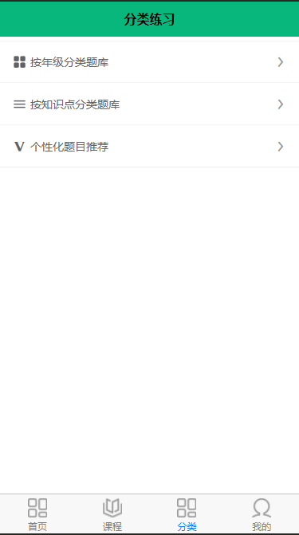

# individuation_practice_recommandation
#### This is a project for elementary studens who want to train their International Olympic Maths Competition
#### Using a knowledge graph to recommand practices to them
---
### 1.Introduction
- User can train IOMC practices through the app from the classfication_train
- Also individuation practices can trace their study situation to recommand practices to them

### 2.Technology review
- Uniapp(Vue)
- django
- mysql
- knowledge graph by protege

### 3.View demonstration
- Home page
 
- register/login
- 

    
    
 

- classfication practices

- knowledge points

- The flow chart for individual practices recommandation

- knowledge graph visualization

